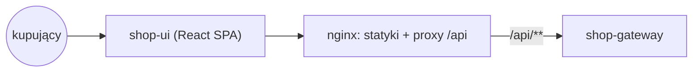
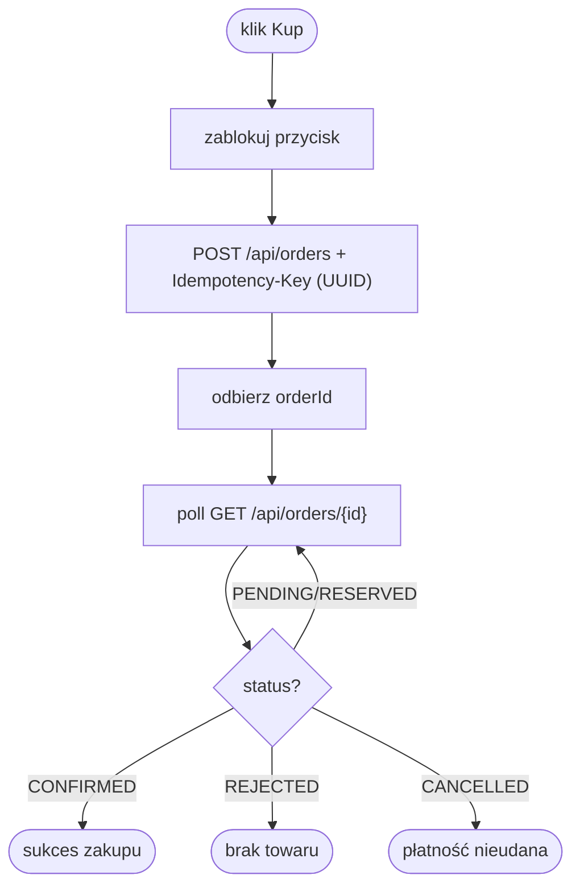

# shop-ui

Frontend — interfejs kupującego (React + Vite). Serwowany jako statyczny build
przez nginx, który również proxuje ruch API do shop-gateway. Standalone repo z
własnym `Dockerfile`. Komunikuje się wyłącznie z shop-gateway.

## Widoki do zaimplementowania

- Lista produktów (`GET /api/products`).
- Szczegóły produktu z **licznikiem dostępnych sztuk na żywo** — przy flash sale
  stan zmienia się co chwilę (WebSocket lub SSE, fallback: polling).
- Proces zakupu: `POST /api/orders` z nagłówkiem `Idempotency-Key` (UUID
  generowany po stronie klienta, ten sam przy ponowieniu).
- Status zamówienia na żywo: `PENDING → RESERVED → CONFIRMED` albo
  `REJECTED / CANCELLED` (SSE lub polling `GET /api/orders/{id}`).

## UX pod flash sale
- Po kliknięciu „Kup" zablokuj przycisk i pokaż stan przetwarzania — saga jest
  asynchroniczna, odpowiedź przychodzi po chwili.
- Czytelnie obsłuż „brak towaru" (REJECTED) i „płatność nieudana" (CANCELLED).
- Nie pozwalaj na wielokrotne wysłanie tego samego zamówienia (idempotency key +
  blokada UI).

## Build i serwowanie (Dockerfile, multi-stage)
1. Etap build: `node` → `npm ci && npm run build` (Vite generuje statyki).
2. Etap runtime: `nginx:alpine`, build do `/usr/share/nginx/html`.
3. nginx:
   - `try_files ... /index.html` — fallback dla routingu SPA.
   - `location /api/ { proxy_pass http://shop-gateway:8080/; }` — proxy do
     shop-gateway w sieci `backend` (jeden origin dla przeglądarki, brak CORS).

## Konfiguracja
`VITE_API_BASE_URL=/api` (resztą zajmuje się proxy nginx). Dostęp:
http://localhost:3000.

## High Level Design (ogólny workflow)

SPA (React) serwowane przez nginx, który proxuje `/api` do gatewaya (jeden origin,
brak CORS). Zakup jest asynchroniczny: po `POST /api/orders` UI odpytuje status
zamówienia aż do stanu terminalnego.

## Low Level Design (diagram aktywności)

Proces zakupu:

