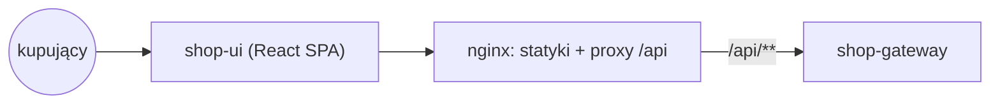
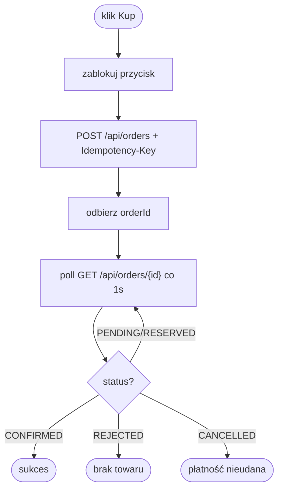

# shop-ui

Frontend zakupów (React 19 + Vite). Serwowany jako statyczny build przez nginx,
który proxuje `/api` do shop-gateway.

## Widoki

- **Lista produktów** — `GET /api/products`
- **Zakup** — `POST /api/orders` z nagłówkiem `Idempotency-Key` (UUID po stronie klienta); przycisk blokowany do zakończenia
- **Status zamówienia** — polling `GET /api/orders/{id}` co 1s; stany: `PENDING → RESERVED → CONFIRMED | REJECTED | CANCELLED`

## Uruchomienie

```bash
npm run dev      # dev server; proxy /api → http://localhost:8080
npm run build    # statyki do dist/
```

## Deploy (Docker, multi-stage)

1. Etap build: `node` → `npm ci && npm run build`
2. Etap runtime: `nginx:alpine` — pliki do `/usr/share/nginx/html`
3. nginx: SPA fallback (`try_files … /index.html`) + proxy `/api/` → `http://shop-gateway:8080`

Dostęp: http://localhost:3000

## Architektura



Proces zakupu:


